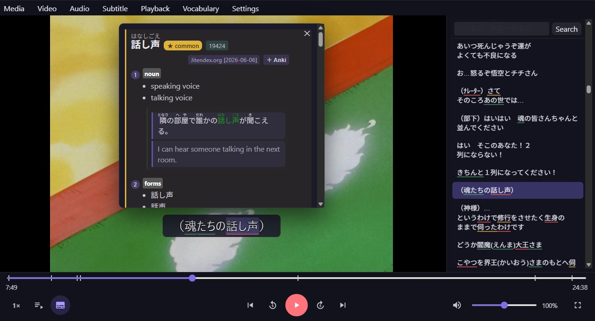
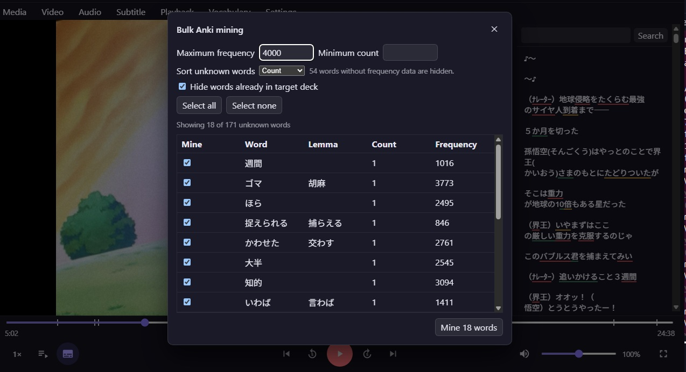

# Kizuna (絆)

Kizuna is a video player for Japanese learners, with built-in vocabulary
knowledge tracking and bulk Anki card extraction from subtitles.

Watch a video, see which words you already know, look up unfamiliar vocabulary,
and turn useful lines into study cards without leaving the player.

Download links for published builds are available on the
[Releases page](../../releases).

## See Kizuna in action

### Watch and explore



Look up words, check the full subtitle track, and create Anki cards without
leaving the video.

### Prepare with bulk Anki mining



Bulk mining lets you turn every unknown word in an episode into Anki cards in
one pass. Review them before you watch so the vocabulary is already familiar
when it appears.

## Features

- Play local video with embedded or external subtitles.
- Read selectable, tokenized Japanese subtitles over the video or in a sidebar.
- Track vocabulary knowledge and highlight words by knowledge level.
- Review vocabulary across an entire subtitle track and create Anki cards in
  bulk.
- Look up words with imported offline Yomitan dictionaries.
- Resume playback, restore subtitle and audio tracks, and navigate recent files.
- Use playlists, A–B looping, frame stepping, screenshots, mini-player mode, and
  configurable keyboard shortcuts.
- Optionally translate whole subtitle lines.

## Install a release

Kizuna publishes unsigned x64 builds for Windows 10 or newer and Ubuntu 24.04
(glibc 2.39). Download the package and `SHA256SUMS.txt` from the same entry on
the [Releases page](../../releases).

On Windows, run `kizuna-<version>-setup.exe` and follow the installer. The
installer is unsigned, so Windows may show an unknown-publisher or Microsoft
Defender SmartScreen warning.

On Ubuntu 24.04 x64, first verify the downloaded Linux package:

```bash
sha256sum --ignore-missing --check SHA256SUMS.txt
```

For desktop integration and automatic dependency installation, install the
deb package:

```bash
sudo apt install ./kizuna-<version>-linux-amd64.deb
# Later, to uninstall:
sudo apt remove kizuna
```

Alternatively, the AppImage runs without installation. Its bundled media tools
use the exact Ubuntu 24.04 mpv and FFmpeg libraries shown below:

```bash
sudo apt update
sudo apt install 'mpv=0.37.0-1ubuntu4' 'ffmpeg=7:6.1.1-3ubuntu5'
chmod +x kizuna-<version>-linux-x86_64.AppImage
./kizuna-<version>-linux-x86_64.AppImage
```

If FUSE mounting is unavailable, use the AppImage runtime's tested no-FUSE
path: `./kizuna-<version>-linux-x86_64.AppImage --appimage-extract-and-run`.
Kizuna requires X11 or XWayland for mpv embedding; native Wayland-only,
headless, container, and SSH-only sessions are unsupported. Run it as a normal
desktop user with Electron's sandbox available. Do not work around a sandbox
error with `--no-sandbox`; use the deb instead.

Both Linux packages are unsigned and may prompt a warning in software that
checks package signatures. Kizuna has no automatic updater. Download new
versions from the Releases page and verify their checksum before installing or
replacing the AppImage.

## Optional services

- **AnkiConnect** enables individual and bulk card creation plus Anki knowledge
  sync. Its default endpoint is `http://127.0.0.1:8765`.
- **WaniKani** knowledge sync requires a personal access token, stored with
  Electron safe storage when available.

Neither service is required for video playback or local subtitle study.

### Optional MeCab UniDic

UniDic is an optional parser dictionary. Install a compatible MeCab UniDic
folder under Kizuna's persistent user-data directory, then restart Kizuna:

- Windows: `%APPDATA%\Kizuna\mecab\unidic`
- Linux: `~/.config/Kizuna/mecab/unidic`

Options > Parser & Dictionaries > Open UniDic folder creates and opens the
folder for you. Keep the dictionary there rather than under the application
installation directory so it survives Kizuna updates. Legacy copies from the
old resource location are migrated during an installer upgrade or the first
startup that can still see them; Linux development installs continue using the
system dictionary.

## Privacy and network access

Playback, subtitle processing, dictionaries, settings, history, and vocabulary
data stay on the computer. Kizuna has no telemetry, analytics, account system,
automatic crash upload, or background update checks.

Network access occurs only when you choose a network feature: translating a
subtitle, syncing WaniKani, or using AnkiConnect. A remote
AnkiConnect endpoint receives mined text and media; plain HTTP does not encrypt
that traffic.

Report security problems privately as described in
[SECURITY.md](SECURITY.md). Never post credentials or private data in an issue.

## Development

Building from source requires Node.js 24 or newer and npm. Windows development
uses staged runtime copies under `resources/`; unpackaged Linux development
uses the distribution's `mpv`, FFmpeg/ffprobe, and MeCab commands. See
[Binary setup](docs/binaries.md) for download sources, expected paths, and
version checks.

Install dependencies and start the development app:

```powershell
npm install
npm run dev
```

To build once and run the production preview:

```powershell
npm run build
npm start
```

### Linux source development

On Ubuntu 24.04, install Node.js 24 and the native build/runtime dependencies,
then use the normal npm workflow:

```bash
sudo apt update
sudo apt install -y build-essential python3 pkg-config mpv ffmpeg mecab mecab-ipadic-utf8
npm ci
npm run dev
```

Use a checkout on the Linux filesystem and do not reuse a `node_modules`
directory produced on Windows; Electron and `better-sqlite3` contain
platform-specific binaries. Kizuna selects Electron's X11/XWayland backend
before startup, so no command-line wrapper is required. To run the production
bundle locally, use `npm run build && npm start`.

## Testing

Run the standard checks:

```powershell
npm run typecheck
npm run lint
npm run format:check
npm test
```

Use `npm run test:watch` while iterating locally. CI runs the standard checks,
the third-party notices, and a production build on both Windows x64 and Linux
x64 for every pull request; see [Contributing](CONTRIBUTING.md).

## Build and packaging

```powershell
npm run build  # Production build in out/
npm run dist   # Windows NSIS installer in dist/
npm run dist:linux # Linux AppImage and deb in dist/ (Ubuntu 24.04 only)
```

Packaging uses the runtime binaries in `resources/` and generates the required
third-party notices. Published pre-releases are built by the release workflow
and are currently unsigned. See
[Binary setup](docs/binaries.md),
[Licensing and notices](docs/licensing.md), and
[Releasing](docs/releasing.md) for details.

## Project documentation

- [Contributing](CONTRIBUTING.md)
- [Code of conduct](CODE_OF_CONDUCT.md)
- [Security policy](SECURITY.md)
- [Architecture](docs/architecture-plan.md)
- [Codebase map](docs/codebase-map.md)
- [Binary setup](docs/binaries.md)
- [Licensing and notices](docs/licensing.md)
- [Releasing](docs/releasing.md)

## License

Copyright (C) 2026 Adam Kocsis.

Kizuna is free software licensed under
[GPL-3.0-or-later](LICENSE), without warranty. Bundled third-party components
remain under their own licenses; their notices and corresponding-source
information ship with the application and are documented in
[docs/licensing.md](docs/licensing.md).
